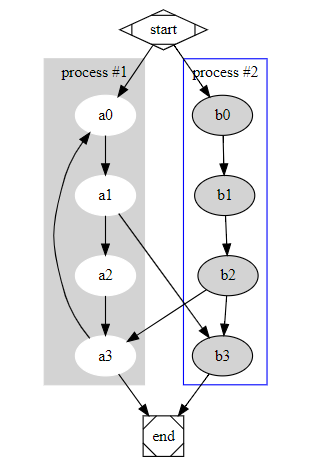

# graphviz的入门与提高

## graphviz介绍
###什么是graphviz？
graphviz 是一种基于dot图形描述型语言 [graphviz]( http://graphviz.org)的用于描述图（graph）和网络图（network）的平面结构化图形表示工具。
属于自动图形绘制。它默认提供了丰富的组件、基本图元，适合在软件工程，数据库设计，网络等领域的可视化显示。
借助相关的工具可以输出丰富的数据格式，比如ps，eps，pdf，png，jpeg，svg等。
graphviz 上手快，只需要对着例子，copy & paste，一个上午就可以完全用起来了。
###谁适合使用graphviz
它和常见的visio画图工具的区别有点像tex和word的区别。虽然所有graphviz的所有功能都可以使用visio，opendraw实现，而且效果外观排版
还不容易调整。但是，因为它是一种描述性的文本，非常适合需要经常编辑或简单高效交流而又无太过于形式美观的需求。总结下适用范围：
+ 快速共享交流流程图，对于画一个简单的图，它比visio方便
+ 适合程序动态生成和修改
+ 多人需要在线编辑或者需要版本管理（可结合git，svn）

## 上手grahviz
### 安装
实际上安装的是dot及其图形工具。
同时建议安装xdot工具，可以直接打开dot文件。xdot可能有时候对中文支持不太好，xdot提供一种快速显示图形，基本满足可见即可得的编辑要求。
ubuntu 下,直接安装既可以，
```
apt install graphviz xdot 
```
windows 下，则直接下载安装。
### 开始第一个graphviz图列
有向图和无向图
``` dot
digraph g{a->b->c;d->c;}
graph{a--b--c;d--c;}
``````
再来个官方样本例子
```dot
digraph G {

	subgraph cluster_0 {
		style=filled;
		color=lightgrey;
		node [style=filled,color=white];
		a0 -> a1 -> a2 -> a3;
		label = "process #1";
	}

	subgraph cluster_1 {
		node [style=filled];
		b0 -> b1 -> b2 -> b3;
		label = "process #2";
		color=blue
	}
	start -> a0;
	start -> b0;
	a1 -> b3;
	b2 -> a3;
	a3 -> a0;
	a3 -> end;
	b3 -> end;

	start [shape=Mdiamond];
	end [shape=Msquare];
}
```


可以单独定义node和edge，以上图为例
``` dot
digraph {

}
```


### 进阶使用
[pic]
主要属性
设置顶点的形状

子图 cluster


HTML表格加上关联边


资料
                      CV   
graphviz的开发与应用
graphviz 是c/c++语言写的，git地址[]()
graphviz的插件覆盖了常见的所有语言，js,python,java,c#,c/c++.                        

graphviz js显示

扩展js，让其支持点击放大等操作

读取和生成dot文件


样图
